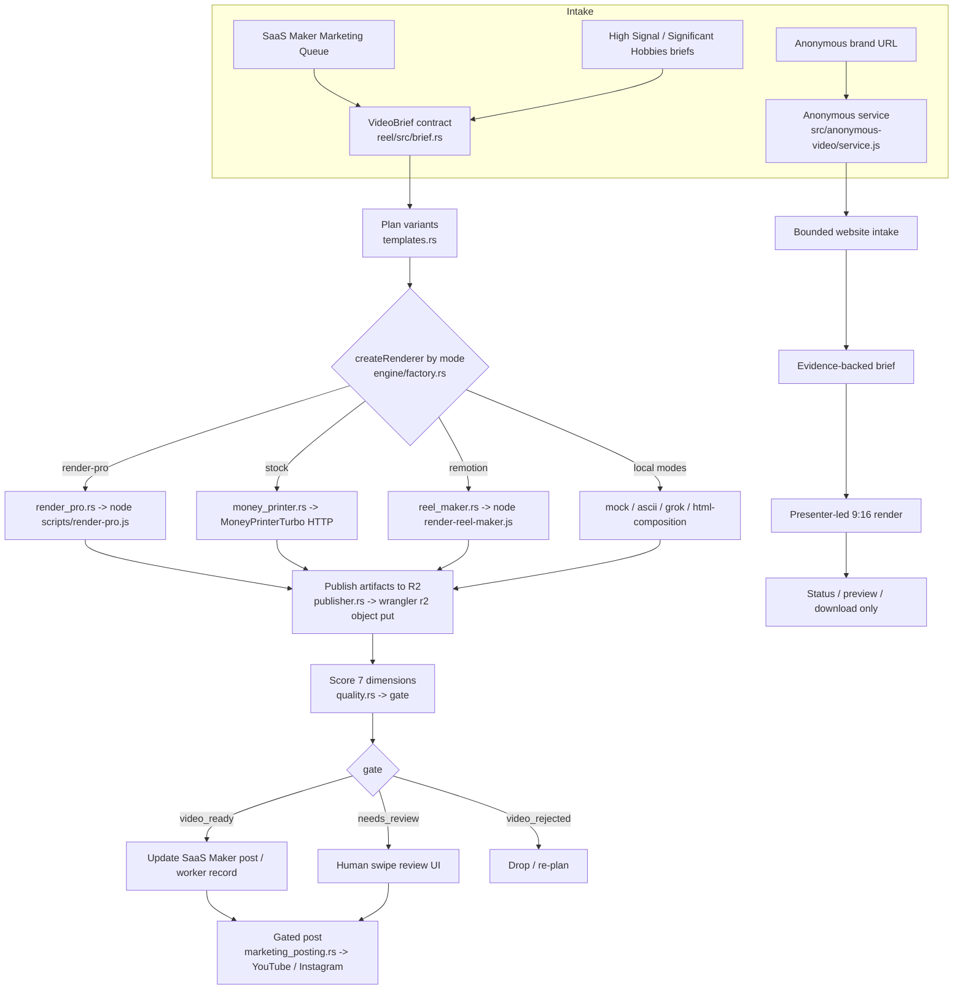

# How it works: a reel end-to-end

This is the learning-oriented companion to the reference docs. It answers one
question: *when a reel gets produced, what actually runs, in what order, and
why is it built this way?* Every claim here is grounded in code you can open.

Where a fact already has a canonical home, this page links instead of
repeating it:

- Control plane, module table, safety properties → [`overview.md`](./overview.md)
- Crate layout, trait boundaries, CLI flags → [`rust-orchestrator.md`](./rust-orchestrator.md)
- Render engines + pinned submodules → [`engines.md`](./engines.md)
- Mode/alias matrix + `VideoBrief` contract → [`render-modes.md`](./render-modes.md)
- The decisions behind the shape → [`decisions/`](./decisions/)

## The one thing to understand first

The pipeline is a **thin orchestrator around heavy shell-outs**. The
orchestration — deciding what to render, planning variants, scoring, publishing,
posting — is Rust (`reel/`). The genuinely heavy media work — driving Chrome,
running ffmpeg, synthesizing speech, uploading to R2 — is *not* reimplemented in
Rust. It stays in Node scripts and external processes, called through trait
objects. Rust never touches the git submodules under `engines/`.

That single design choice explains almost everything else, so keep it in mind.

## Current implementation state (verify, don't assume)

The Rust cutover described in older notes as "Phase 1" is **done**. As of this
writing:

- **All entrypoints are the Rust CLI.** `reel/src/cli.rs` defines
  `Render`, `Watch`, `Autopilot`, `RenderAccepted`, `Post`, `Metrics`, `Plan`,
  `ValidateBrief`, `Score`, `Config`. `package.json` scripts (`watch:render`,
  `autopilot`, `render:pro:rs`, `post:ready`, `sync:metrics`) shell into
  `cargo run --manifest-path reel/Cargo.toml`.
- **Every render engine is a Rust trait impl.** `reel/src/engine/` contains
  `mock`, `ascii_animation`, `grok_video`, `html_composition`, `money_printer`,
  `reel_maker`, `render_pro`, plus a `factory.rs` enum that dispatches by mode —
  the Rust equivalent of the old JS `createRenderer`.
- **The heavy renderer is still JavaScript.** `scripts/render-pro.js` is ~1680
  lines and is *not* ported. `reel/src/engine/render_pro.rs` only builds the
  `node scripts/render-pro.js <reelId>` invocation and runs it through a
  `CommandRunner`. This is deliberate — see the decision note below.
- **The media adapters under `src/adapters/*.js`** (moneyprinterturbo, elevenlabs,
  pexels, kokoro, deepseek, grok-video, ...) remain the underlying
  implementations the Rust engines call out to. They are integration glue, not
  dead code.

So the honest one-liner: **Rust owns orchestration and mode dispatch; Node owns
the pixels.**

## The pipeline stages

## Following one reel through (marketing autopilot path)

This is the SaaS-Maker-driven flow, orchestrated end-to-end in Rust.

**1. Intake → `VideoBrief`.** A brief is normalized and validated by
`reel/src/brief.rs`. The struct (`VideoBrief`) carries `project_slug`,
`channel`, `title`, `hook`, `body`, optional `cta`, `product_url`, `proof_url`,
`demo_steps`, `screenshots`, plus `render_mode` and `duration_seconds`. Both
camelCase and snake_case inputs are accepted so it can ingest JSON from either
the JS surfaces or fixtures. `toMoneyPrinterRequest` produces the shape the
stock engine expects. *Why a contract:* it is the single choke point where
untrusted queue data becomes a typed, validated object before any process is
spawned.

**2. Plan variants.** `templates.rs` holds an *ordered* template catalog
(`templates()`), `selectTemplate` matching, and `build_variant_plan`, which turns
one brief into N variant plans with per-variant hook rewrites. Order matters:
the first matching template wins. *Why:* one brief should yield several
competing cuts so scoring can pick the best, without re-fetching source data.

**3. Dispatch by mode.** `orchestrator.rs::render_reel_variants` (the port of the
old `renderReelVariants`) loops each variant and calls the engine chosen by
`engine/factory.rs` from `render_mode`. Default mode is `mock`; the full mode +
alias matrix lives in `config/render-modes.json`. Local/no-credential modes
(`mock`, `html-composition`, `ascii`, `grok-video`) exist so the whole loop is
testable and demoable with zero API keys — see
[decision 0003](./decisions/0003-local-first-render-modes.md).

**4. Render (the heavy part).** For the production `render-pro` path,
`render_pro.rs` builds `node scripts/render-pro.js <reelId>` and runs it via a
`CommandRunner`. Inside that Node script: Chrome CDP drives a scroll-tour and
live screencast of the real product URL (`config/project-urls.json` is the
source of truth for URLs), Edge TTS (via `uvx`) makes the voiceover, SRT-synced
captions are burned in, and ffmpeg assembles scene cards, Ken Burns motion,
`xfade` stitching, an ambient bed, and SFX. *Why keep it in JS:* it is a
mature, working ~1680-line renderer; rewriting Chrome/ffmpeg/TTS orchestration
in Rust would be pure risk for no orchestration benefit —
[decision 0001](./decisions/0001-rust-orchestrator-cutover.md) scoped the rewrite
to the *glue* only.

**5. Publish.** Completed renders (and only completed ones — mirroring the JS
`status === 'completed'` guard in `orchestrator.rs::render_one`) are published by
`publisher.rs`, whose `R2Publisher` shells out to `npx wrangler r2 object put`.
`NoopPublisher` is the pass-through used in dry runs and tests. Artifact key
naming, content-type, and cache-buster URLs are pure logic in `artifact.rs`.

**6. Score + gate.** `quality.rs` scores seven dimensions (value clarity, proof
strength, visual trust, caption readability, mobile composition, cringe risk,
posting readiness) and maps the result to one gate: `video_ready`,
`needs_review`, or `video_rejected`. This is pure, unit-tested logic with no I/O.
*Why a gate:* it keeps low-quality or unproven cuts out of the posting path
without a human in the loop for the obvious rejects.

**7. Hand back + post.** The result is written back to the SaaS Maker post
(`saas_maker.rs`, `ureq` list/patch) with asset/result URLs. Posting is
separate and gated: `marketing_posting.rs` posts to YouTube/Instagram only after
an accepted item **and** a successful provider response. Manual posting records
`prepared`, never `posted`; the `DryRunPoster`/`ManualPoster` defaults cannot
post. See [`operations/auto-posting.md`](../operations/auto-posting.md).

## The worker render path (production render trigger)

The worker flow is the other half of the same machine. The Cloudflare Worker
(`src/worker/index.js`) stores reel drafts in R2 and serves them: `POST /reels`
and `/reels/signal` create drafts, `GET /review` serves the swipe UI
(`src/review-ui.js`), `PATCH /reels/:id/decision` approves the idea,
`PATCH /reels/:id/video-decision` accepts/rejects the rendered video, and
`GET /reels/:key` serves the MP4 with byte-range support.

`reel watch --execute` (`reel/src/watcher.rs`) polls the worker every ~30s for
reels that are approved but not yet rendered (`needs_render`), then runs
`render-pro.js` **serially, one at a time** via the same `RenderProEngine`.
*Why serial:* Chrome + ffmpeg are memory- and CPU-heavy; concurrent renders on
one host thrash. The watcher enforces `MIN_INTERVAL_MS` and a `max_per_tick` cap.

## The anonymous brand-reel path (a separate, sealed flow)

The public visitor surface is intentionally *not* wired into the marketing
orchestrator. `src/anonymous-video/service.js` runs its own small state machine:
bounded website intake (`website-intake.js`, DNS-pinned) → evidence-backed brief
(`brand-brief.js`) → presenter-led 9:16 render (`renderer.js`, using the
checksum-pinned synthetic presenter in `presenter-library.js`) → status /
preview / download only. It has **no** auth, billing, workspaces, actor
marketplace, payouts, social posting, or scheduling — that boundary is a product
decision, not an oversight ([decision 0005](./decisions/0005-anonymous-no-auth-product-boundary.md)).

## Why the trait boundaries matter (the testability payoff)

Every external effect is a trait with a real impl and a fake:

- `CommandRunner` → `ProcessRunner` (real `std::process::Command`) vs a
  recording fake that asserts the exact argv.
- `ArtifactPublisher` → `R2Publisher` vs `NoopPublisher`.
- `RenderEngine` → the shell-out engines vs `MockEngine`.
- `MarketingClient` / `SocialPoster` → live HTTP vs stub/dry-run.

Because of this, the entire orchestration is unit-tested **without Chrome,
ffmpeg, or network** — tests assert the `node`/`wrangler` argv that *would* run.
The full trait table is in [`rust-orchestrator.md`](./rust-orchestrator.md).

## Safety invariants baked into the flow

These hold by construction; see [`overview.md`](./overview.md) for the full list.

- Submodules under `engines/` are never read, entered, or modified — engines are
  reached only through adapters.
- Secrets resolve from the environment at runtime (`*Env` keys); no token is
  embedded or logged.
- Render, upload, and post are shell-outs that **default to dry-run**; live
  actions require an explicit `--execute`.
- Posting requires an accepted item and a successful provider response.

## Where to look next

- Run the flow: [`development/commands.md`](../development/commands.md).
- What "ready" means and how it's proven: [`development/testing.md`](../development/testing.md).
- Operate it in production: [`operations/deployment.md`](../operations/deployment.md).
