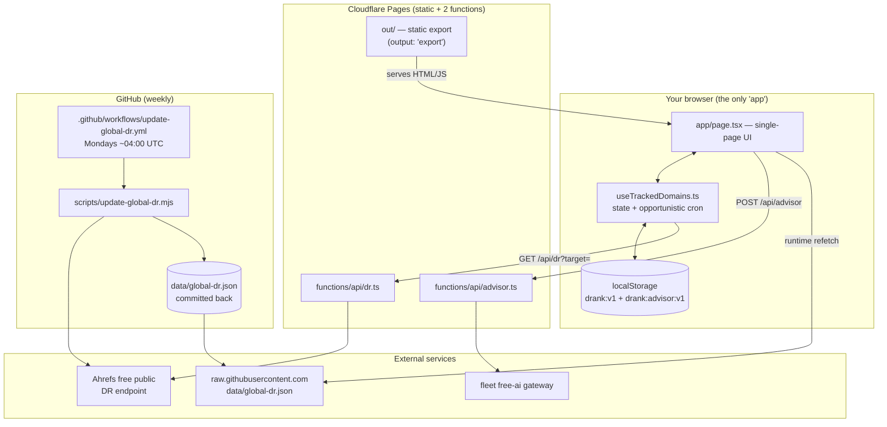

# How drank works, end to end

**A guided walk-through, not a reference.** This page follows the paths that
data actually takes through drank so you can build a mental model of *why* the
system is shaped the way it is. For the flat list of files and the topology
diagram, read the [architecture overview](overview.md) first — this page
assumes you've skimmed it and leans on the [ADRs](decisions/) for the "why"
rather than restating them.

> **One-sentence version:** drank is a fully static Next.js page on Cloudflare
> Pages whose only moving parts are your browser's `localStorage`, two thin
> Pages Functions, and a weekly GitHub Action — nothing else runs a server.

## The mental model in one diagram



## Component 1 — the static page (the whole app)

drank is a **Next.js 16 app exported to static files**: `next.config.ts` sets
`output: 'export'`, so the build emits an `out/` directory of plain HTML, CSS,
and JS with no Node server behind it. The entire interactive UI is a single
route, `app/page.tsx`. `app/data/page.tsx` adds one more static page (a public
weekly-movers table). That's the whole surface area.

**Why static?** drank has no accounts, no server-side user data, and no
per-user rendering — every visitor gets the same HTML and then hydrates their
*own* data from the browser. Static export means the app is a CDN artifact:
cheap, fast, and impossible to take down with load. The trade-off (no server to
run dynamic code) is the entire reason components 3 and 4 exist. See
[ADR-0001](decisions/0001-static-export-to-cloudflare-pages.md).

## Component 2 — localStorage as the personal database

There is no user database. All of *your* data — the domains you track, every DR
measurement over time, your leaderboard predictions, and your settings — lives
in a single JSON blob in your browser under the `localStorage` key `drank:v1`.
The authoritative shape is `StoredState` in `lib/types.ts`:

```ts
{ version: 1 | 2, domains: TrackedDomain[], lastGlobalRefresh, autoRefreshEnabled, lastAutoRefresh, predictions }
```

Each `TrackedDomain` carries a `history: HistoryPoint[]` array of
`{ ts, dr }` samples — that time series *is* the chart. `lib/utils.tsx`
owns the read/write primitives (`loadState`, `saveState`), and
`lib/useTrackedDomains.ts` is the single React hook that holds all state and
persists it on every mutation via a `persist()` helper.

**Why localStorage-only?** It's what makes the "no server" story hold together:
if personal data never leaves the browser, there's nothing to authenticate,
store, secure, or comply with. The cost is that data is device-local and
disposable — which is why the hook exposes `exportData`/`importData` (JSON
download / upload) as the manual backup and sync mechanism.

> **Schema-version footgun:** the *key* is `drank:v1` but the *payload*
> `version` field is now `2` (v2 added `autoRefreshEnabled`, `lastAutoRefresh`,
> and `predictions`). The key name is frozen for backward compatibility; don't
> read the `v1` in the key as the current schema version.

## Component 3 — the two Pages Functions (the only dynamic code)

Because the build is static, Next.js API routes can't run. The two things drank
genuinely needs a server for are implemented instead as **Cloudflare Pages
Functions** under `functions/api/`, which `wrangler pages deploy` serves at the
same URL paths the client already calls. See
[ADR-0004](decisions/0004-pages-functions-as-api-proxy.md).

**`functions/api/dr.ts` — the Ahrefs proxy.** It exists for exactly two
reasons: browsers can't call the Ahrefs endpoint directly (CORS), and Ahrefs
wants a real `User-Agent`. So the function normalizes the target hostname
(strips `www.`, forces `https`, rejects anything without a dot), calls
`https://api.ahrefs.com/v3/public/domain-rating-free`, unwraps
`domain_rating.domain_rating`, and returns `{ domain, dr, fetchedAt }`. It maps
Ahrefs 429s straight through so the UI can show a friendly rate-limit message.
It holds **no secrets** — the Ahrefs endpoint is free and unauthenticated.

**`functions/api/advisor.ts` — the DR Advisor gateway.** This one *does* hold a
secret (`FREE_AI_GATEWAY_API_KEY`), which is the whole point of putting it
server-side: the key must never reach the browser. It takes a **bounded**
request (domain + observed DR + a trend), forwards it to the fleet free-ai
gateway with a deliberately conservative system prompt (`temperature: 0.2`,
`response_format: json_object`), and returns validated structured advice. The
prompt explicitly forbids inventing site-specific causes because the model only
ever sees a number and a trend — it has no backlink or traffic data. See
[ADR-0003](decisions/0003-dr-advisor-server-side-gateway.md) for the
structured-output + browser-cache design and
[the advisor gateway runbook](../operations/runbooks/advisor-gateway.md) for
configuring the key.

## How data flows

### Flow A — you track a domain

1. You type a domain; `addDomain()` in `useTrackedDomains.ts` normalizes it
   (`normalizeDomain`), rejects sites already in the shared example set, adds a
   `TrackedDomain` with empty history, and marks it `isCustom: true`.
2. It immediately calls `refreshDomain()`, which calls `fetchDomainRating()` in
   `lib/utils.tsx` → `GET /api/dr?target=…`.
3. The Pages Function proxies Ahrefs and returns `{ dr, fetchedAt }`.
4. `applyNewPoint()` appends `{ ts, dr }` to that domain's `history`, dedupes on
   timestamp, sorts, and calls `persist()` → `localStorage`.
5. React re-renders; the sparkline / `DrHistoryChart` reads straight from the
   history array. **The chart is just the persisted time series drawn.**

"Refresh all" (`refreshAll`) walks every tracked domain in a loop, pausing
`REFRESH_DELAY_MS` (750 ms) between requests to be polite to the free endpoint —
see [ADR-0006](decisions/0006-request-pacing.md).

### Flow B — the client-opportunistic "weekly cron"

drank wants your *own* tracked sites refreshed roughly weekly, but a static site
has no scheduler. The workaround: a **client-side opportunistic cron**. Whenever
the dashboard is open — on mount, on tab focus/visibility, and via a light
~3-hour interval — `checkAndTriggerAuto()` compares `now - lastAutoRefresh`
against `WEEK_MS`. If more than a week has passed and you have custom sites, it
runs `runAutoRefreshNow()` (the same paced loop as Flow A, scoped to
`isCustom` domains) and stamps `lastAutoRefresh`. If you never open the tab, it
simply doesn't run — which is the honest trade-off, documented in
[ADR-0002](decisions/0002-client-opportunistic-weekly-cron.md).

### Flow C — the global leaderboard (dual data source)

The shared leaderboard uses **two sources for the same data on purpose**:

- **Build time:** `data/global-dr.json` and `data/global-sites.json` are
  `import`ed into `app/page.tsx`, so the leaderboard renders instantly with no
  network wait.
- **Runtime:** a `useEffect` then refetches those same files from
  `raw.githubusercontent.com/.../drank/main/data` with `cache: 'no-store'` and,
  if the fetch succeeds, swaps in the fresher data. If it fails, the page
  silently keeps the build-time copy.

**Why both?** So the weekly Action's fresh numbers show up **without a
redeploy**, while a failed or slow GitHub fetch never blocks first paint. See
[ADR-0005](decisions/0005-dual-data-sources.md).

### Flow D — asking the advisor

The DR Advisor is opt-in: you click Explain on a domain, `DrAdvisor.tsx` builds
a bounded request and `POST`s `/api/advisor`. Results are cached in
`localStorage` under `drank:advisor:v1`, keyed by a measurement bucket so the
same DR/trend doesn't re-spend a gateway call. `lib/dr-advisor.ts` owns the
request/advice contracts and parsing, shared by both the client and the Pages
Function so the shape can't drift.

## Component 4 — the weekly leaderboard refresh (GitHub Action)

The one true scheduler in the system lives in GitHub, not Cloudflare:
`.github/workflows/update-global-dr.yml` runs every **Monday ~04:00 UTC** (plus
manual `workflow_dispatch`). It runs `scripts/update-global-dr.mjs` twice — once
for the global list and once for `data/fleet-sites.json` — fetching DR for each
seed site (paced `DELAY_MS = 650`), appending a new `{ ts, dr }` point to each
domain's history in `data/global-dr.json` / `data/fleet-dr.json`, copying them
into `public/data/`, and **committing the result back to `main`**.

That commit is what closes Flow C: the new JSON on `main` is exactly what the
running app refetches from `raw.githubusercontent.com`. So the leaderboard stays
fresh with zero deploys — the git repo *is* the shared database. See
[the weekly global DR job runbook](../operations/jobs/weekly-global-dr.md) and
[the add-a-site runbook](../operations/runbooks/add-global-site.md).

## Putting the "why" together

Every major decision falls out of one root choice — *be a static artifact with
no user backend* — and the rest of the system is the set of minimal escape
hatches that choice forces:

| Constraint from "static, no backend" | Escape hatch | Why it's the smallest fix |
|---|---|---|
| No server to store user data | `localStorage` + JSON export/import | Zero infra; data can't leak because it never leaves the device |
| No server to bypass CORS / hide keys | 2 Pages Functions | Only the genuinely-dynamic 2 endpoints run code; everything else stays static |
| No scheduler for personal sites | Client-opportunistic cron | Refresh happens when someone's looking, costs nothing when idle |
| No scheduler for shared data | GitHub Action → commit | Reuses the repo as the shared store; app refetches raw JSON, no redeploy |

## Where to go next

- [Architecture overview](overview.md) — files, topology, monitoring.
- [ADRs 0001–0006](decisions/) — the recorded reasoning behind each choice.
- [Failed approaches](../knowledge/failed-approaches/README.md) — notably
  [Vercel + Next API routes](../knowledge/failed-approaches/vercel-and-next-api-routes.md),
  the shape drank moved *away* from.
- [Development workflow](../development/workflow.md) — how to build and test it.
