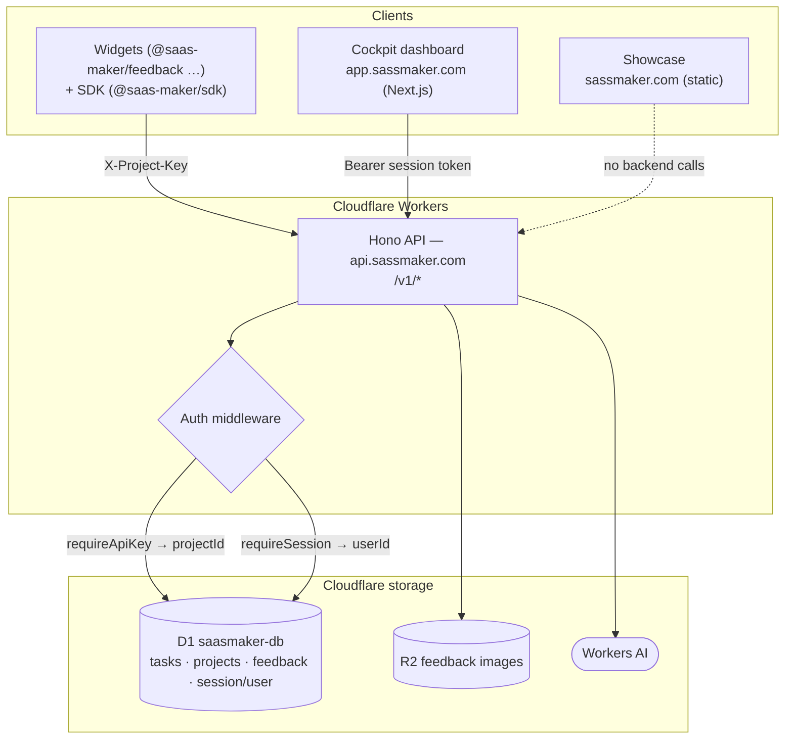

# How SaaS Maker works, end to end

This is a **learning** doc. It explains how SaaS Maker (internally: *Foundry*)
is put together for someone reading the code for the first time, and grounds
every claim in the actual source. It intentionally does not repeat the
day-to-day product docs — for the shape of each service see
[the primitives](/index) and the per-service pages under `docs/services/`; for
the "why" behind subsystems, follow the links to
[decisions](decisions/README.md).

## The one-paragraph version

SaaS Maker is a Cloudflare-native monorepo. One **Hono API** on Workers owns a
single **D1** database and speaks only REST over `/v1/*`. Everything else — a
static marketing site, a Next.js dashboard, a TypeScript SDK, and drop-in React
widgets — is a *client* of that API. Marketing content is public and static; the
dashboard is authenticated; embeddable widgets and fleet "spokes" authenticate
with a per-project API key. There is no shared server-side code between clients
and the API beyond typed contracts — services stay decoupled and talk over HTTP.

## Monorepo shape

pnpm workspaces + Turborepo. The pieces that matter:

| Path | What it is | Runtime |
|---|---|---|
| `apps/showcase` | `sassmaker.com` apex marketing site (`@saas-maker/landing-page`) | Astro, **static** — no SSR adapter |
| `apps/cockpit` | `app.sassmaker.com` dashboard (`@saas-maker/dashboard`) | Next.js on Cloudflare via OpenNext |
| `workers/api` | the API — `api.sassmaker.com` | Hono on Cloudflare Workers |
| `workers/droid` | sandboxed task runner (see [droid.md](droid.md)) | Workers |
| `packages/blocks/sdk` | `@saas-maker/sdk` TypeScript client | published npm package |
| `packages/widgets/*` | drop-in React widgets (`@saas-maker/feedback`, `-changelog`, `-testimonials`, `-waitlist`) | published npm packages |
| `packages/ui` | `@saas-maker/ui` shared component primitives (button, card, badge…) | internal library |
| `packages/cli` | the `fnd` CLI | published npm package |
| `apps/docs-blume` | renders this `docs/` tree | Blume (Astro), static |

Two facts that trip people up:

- **The docs live at the repo root in `docs/`, not inside the docs app.**
  `apps/docs-blume/blume.config.ts` sets `content.root: '../../docs'`. Blume is
  only the presentation + search layer; the committed Markdown is the source of
  truth.
- **`apps/showcase` is pure static.** `astro.config.mjs` sets `output: 'static'`
  with `build.format: 'file'` and inlined stylesheets, and it deploys as the CF
  Pages project `saas-maker-home` (per `apps/showcase/wrangler.toml`). It has no
  server; it never touches D1.

## The API is the center of gravity

`workers/api/src/index.ts` is a single Hono app. It:

1. Sets CORS from an allow-list (`app.sassmaker.com`, `sassmaker.com`,
   localhost, plus `*.pages.dev` / `*.workers.dev` / `*.sassmaker.com`), so
   widgets embedded on fleet sites can call it.
2. Assigns a `requestId` per request and lazily configures PostHog, flushing the
   batch via `executionCtx.waitUntil` after each response (skipping `/health`).
3. Applies a rate limit to `/v1/*` — `rateLimit({ limit: 100, period: 60 })`,
   skipping `/v1/ai`.
4. Mounts each domain as its own router: `app.route('/v1/feedback', feedback)`,
   `'/v1/tasks'`, `'/v1/projects'`, `'/v1/changelog'`, `'/v1/waitlist'`, and so
   on. Each router lives in `workers/api/src/routes/`.

Its Cloudflare bindings (`workers/api/wrangler.toml`) are the whole backend
surface: `DB` → D1 `saasmaker-db`, `FEEDBACK_IMAGES` → R2
`saasmaker-feedback-images`, `AI` → Workers AI, and an `unsafe` ratelimit
binding. There is no separate app server — the Worker *is* the backend.

## Request/data flow

Trace one feature — **feedback submission** — through the layers:

1. A visitor uses the embedded `@saas-maker/feedback` widget. Its client
   (`packages/widgets/feedback-widget/src/api.ts`) `POST`s to
   `https://api.sassmaker.com/v1/feedback` with an `X-Project-Key` header. The
   `@saas-maker/sdk` does the identical call via `client.feedback.submit(...)`.
2. `feedback.post('/')` runs the `requireApiKey` middleware
   (`workers/api/src/middleware/auth.ts`), which looks the key up with
   `db.getProjectByApiKey(...)` and stashes `projectId` on the context.
3. The handler validates the body, then calls `db.createFeedback(...)`, tagging
   the row with that `projectId`. It fires a PostHog `feedback_submitted` event
   and returns `201`.
4. The row lands in the `feedback` table in D1. The operator later reads it back
   in Cockpit or via `client.feedback.list()`.

The **tasks** flow is the same idea with the *other* auth mode: `tasks.get('/')`
uses `requireSession` (a logged-in operator), resolves a `userId`, and calls
`db.listTasks(userId, …)`. Feedback is project-scoped; tasks are user-scoped.

## The block / SDK model

"Blocks" are the reusable client pieces. `@saas-maker/sdk`
(`packages/blocks/sdk`) wraps the REST API in a typed client:
`SaaSMakerClient` composes one service object per domain
(`feedback`, `tasks`… ) over a shared `HttpClient` (`src/http.ts`). The client
takes either an `apiKey` or a `sessionToken` and the `HttpClient` picks the
header accordingly — `X-Project-Key` for `auth: 'project'`, `Authorization:
Bearer` for `auth: 'session'`. Base URL defaults to `https://api.sassmaker.com`.

The **widgets** (`packages/widgets/*`) are self-contained React components that
call the same endpoints directly — they don't depend on the SDK, they just need
a project key. This is deliberate: a widget dropped onto any fleet site should
ship as little as possible and authenticate with a public-safe project key, not
a session.

## Auth: two token types, one shared table

There are exactly two ways to authenticate, both in
`workers/api/src/middleware/auth.ts`:

- **`requireApiKey`** — reads `X-Project-Key`, resolves it to a project, sets
  `projectId` + `project`. Used by widgets and SDK "project" calls (feedback
  submit, changelog reads, etc.). This is *project* scoping.
- **`requireSession`** — reads `Authorization: Bearer <token>` and resolves it
  to a `userId`. Used by operator/dashboard endpoints (tasks, roadmap admin).

The interesting decision is how session tokens resolve. Cockpit signs users in
with **better-auth** and Google OAuth (`apps/cockpit/src/lib/auth.ts`), writing
sessions into the **same D1 database** through better-auth's Drizzle adapter.
The API has **no better-auth dependency**. Instead `resolveBetterAuthSession`
runs a raw SQL join against the shared `session` / `user` tables to validate the
opaque bearer token and check `expiresAt`, then mirrors the user into the API's
own `users` table via `upsertUser`. `resolveBearerUserId` tries, in order: a
local-dev bypass token, CLI tokens (the `sm_` prefix, looked up in a CLI-token
table), then a better-auth session. **Why:** the dashboard and the API can each
own their auth stack and still trust the same tokens, because the D1 tables are
the contract — no shared runtime, no service-to-service auth call.

## Data layer: Drizzle *and* raw SQL, on purpose

`workers/api/src/db.ts` exposes a single `getDb(d1)` object with one method per
operation. Two things to know before you trust `schema.ts`:

- **The schema file is not the whole database.** `workers/api/src/schema.ts`
  defines Drizzle tables for `users`, `projects`, `feedback`, `changelog`,
  `task_comments`, `task_workflows`, and more — but **the main `tasks` table is
  not there.** It is created by a raw migration,
  `workers/api/migrations/0004_tasks.sql` (`CREATE TABLE IF NOT EXISTS tasks
  …`), and later migrations extend it. If you want the real task columns, read
  the migrations and the `TaskRow` interface in `db.ts`, not `schema.ts`.
- **Most queries are hand-written D1 prepared statements, not Drizzle.**
  `getDb` calls `getDrizzle(d1)` but the vast majority of methods
  (`getProjectByApiKey`, `createFeedback`, `listTasks`, `createTask`…) use
  `d1.prepare('SELECT … FROM …').bind(...)` directly. Drizzle is available but
  the code leans on raw SQL for the queries that need joins/computed columns
  (e.g. `has_changelog` is an `EXISTS` subquery baked into the task SELECTs).
  Treat Drizzle here as the migration/type source, not the query builder.

Migrations under `workers/api/migrations/` are the authoritative schema history.
When schema questions and `schema.ts` disagree, the migrations win.

## Key design decisions and why

- **API-first, HTTP-only boundary.** Every capability is a `/v1/*` route;
  Cockpit, the CLI, the SDK, and widgets all go through the same contract, so an
  agent and a human use identical surface area. Nothing bypasses the API to
  touch D1 directly except the API itself and — by shared-table convention —
  better-auth's session writes. See the
  [Foundry operational-layer decision](decisions/04-25-foundry-operational-layer.md).
- **One database, service decoupling by tables not by code.** The auth bridge
  (above) is the clearest example — decoupling is enforced by *not sharing a
  runtime dependency*, only sharing D1 tables. See the
  [hub-and-spoke evaluation](decisions/06-19-fleet-hub-and-spoke-eval.md).
- **Static where possible.** Marketing (`showcase`) and docs (`docs-blume`) are
  pure static builds so the marketing LCP path is one round-trip and there is no
  server to keep warm. Only Cockpit needs SSR, so only Cockpit runs OpenNext.
- **Widgets ship without the SDK.** Fewer bytes on someone else's page, and a
  public project key is the only credential a widget ever needs.
- **Fail-open rate limiting.** `middleware/rate-limit.ts` swallows limiter
  errors and calls `next()` — availability is preferred over strict enforcement,
  consistent with the fleet standard of being conservative with limiters.

## Where to read next

- Per-service request/response detail: `docs/services/*` (feedback, tasks,
  changelog, waitlist…).
- The orchestration layer that sits on top of tasks:
  [Symphony](symphony.md) and the [Droid runner](droid.md).
- The dated rationale for each subsystem: [decisions/](decisions/README.md).
