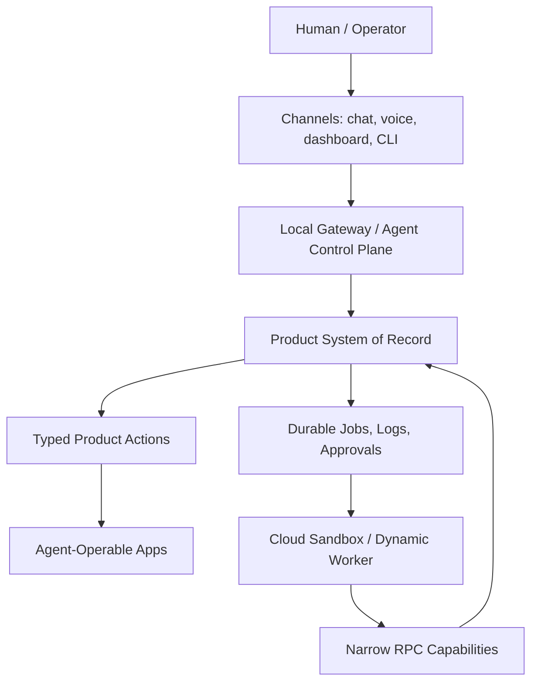

# Agent Operating Systems: OpenRoom, OpenClaw, and Dynamic Workers

**Date:** May 2, 2026
**Status:** General research note
**Scope:** Future-facing product and infrastructure direction, not a narrow SaaS Maker implementation plan.

## Thesis

The useful direction is not "one agent that can click everything." It is a layered agent operating system:

1. **Agent-operable applications** expose typed actions and state.
2. **Local gateways** connect agents to personal devices, channels, files, and tools.
3. **Cloud sandboxes** run generated or tenant-specific code with narrow permissions.
4. **Product systems of record** keep tasks, logs, policies, data, and approvals durable.

OpenRoom, OpenClaw, and Cloudflare Dynamic Workers each represent one layer of that future.

## What OpenRoom Shows

OpenRoom is a browser-based desktop where apps are integrated with an AI agent through a structured action system. The local trial made one thing clear: OpenRoom is not a native desktop application and should not be treated as a product-quality foundation. It is a web app that simulates a desktop inside the browser.

The useful idea is not the macOS-like UI, and the current open-source project quality is too weak to adopt wholesale. The useful idea is that every app exposes a machine-operable contract.

OpenRoom's strong patterns:

- Apps are isolated into predictable folders with metadata, state, and actions.
- The agent operates apps through actions instead of visual guessing.
- The browser becomes a local, inspectable workspace.
- Data can stay local for lightweight personal use.
- App generation has a staged workflow: analysis, architecture, planning, codegen, assets, integration.
- Each app can ship an agent-visible `meta.yaml` and `guide.md` so the agent knows valid actions and file schemas.
- User actions can be reported back to the agent through an event bus.

OpenRoom's limitations:

- The open-source standalone version uses a local mock for the container runtime.
- It is more of a reference environment than a mature platform substrate.
- A desktop metaphor can become decorative if the underlying apps do not expose serious action contracts.
- It is not a native Mac app and does not control native Mac applications.
- The built-in mini-apps are demo-quality and feel vibe-coded rather than production-designed.
- The agent UX depends heavily on model tool-calling quality; weaker/free models may leak raw JSON into the chat UI.
- The character/story layer is entertainment-oriented and not generally useful for developer/operator workflows.

Local trial decision: do not keep OpenRoom installed as a dependency or operating surface. Extract the contracts and workflow ideas, then discard the project.

General lesson: build products so agents can operate them through typed action APIs, not by scraping UI pixels or imitating a desktop.

## Desired Desktop Direction

The stronger future direction is a real local desktop agent, not a browser desktop clone.

For personal use, the ideal system should run as a native Mac application or tightly integrated local daemon with explicit permission boundaries. It should be able to:

- see and control selected native Mac applications through accessibility permissions, AppleScript, Shortcuts, browser automation, or app-specific APIs
- read and write approved local folders
- expose a local action registry for apps, scripts, projects, and automations
- keep audit logs of every local action
- require approval for destructive or external side effects
- pair with chat, voice, CLI, and dashboard surfaces
- optionally delegate risky generated code to a cloud sandbox instead of running everything on the host

This is closer to a polished OpenClaw-style local gateway plus native Mac control than to OpenRoom. OpenRoom's browser shell may still be useful for prototyping app contracts, but it should not define the product direction.

## Extractable Patterns From OpenRoom

The parts worth extracting are:

- **Action manifests:** every app publishes what an agent can do.
- **Agent-readable guides:** every app documents valid data paths, schemas, and update rules.
- **Structured local state:** apps expose state as files or typed records rather than opaque UI.
- **Action bus:** one generic dispatcher can route agent actions to many apps.
- **Refresh semantics:** agents mutate state, then notify apps to reload or sync.
- **User-action reporting:** apps can tell the agent what the human just did.
- **Session scoping:** local state should be grouped by character/project/session/task.
- **Staged generation workflow:** new app creation should pass through requirement analysis, architecture, task planning, codegen, integration, and verification.

The parts to avoid are:

- fake desktop chrome as the main product value
- demo apps without serious workflows
- prompts that depend on fragile model obedience
- entertainment character layers for operator tools
- assuming browser-local storage is enough for durable product work
- depending on visual control for software whose action layer we own

## What OpenClaw Shows

OpenClaw is a local-first personal assistant gateway. It connects messaging channels, models, tools, skills, sessions, cron, voice, browser, and local workspaces into an always-on assistant.

OpenClaw's strong patterns:

- The gateway is the control plane.
- Channels are first-class: WhatsApp, Telegram, Slack, Discord, Signal, iMessage, Teams, and others.
- Skills are installable operational units.
- Sessions and workspaces give agents continuity.
- Local-first deployment keeps the operator in control.
- Sandboxing exists for non-main or remotely exposed sessions.

OpenClaw's risks:

- The main session can run with broad host access.
- Messaging inputs are untrusted by default and need strong pairing/allowlist policy.
- Skill/plugin ecosystems create supply-chain risk.
- Always-on agents need budget, permission, audit, and approval boundaries.

General lesson: local gateways are powerful, but they should be treated like privileged operator infrastructure, not casual app dependencies.

## What Dynamic Workers Show

Cloudflare Dynamic Workers provide a cloud sandbox for code loaded at runtime. This is useful when the agent needs to write code and execute it near the data, but should not receive raw credentials, direct database handles, or broad network access.

Dynamic Workers' strong patterns:

- Per-run or per-tenant code can execute in isolated Workers.
- Host code decides exactly which bindings and RPC capabilities are passed in.
- Outbound network can be blocked or intercepted.
- Generated JavaScript/TypeScript can call narrow typed APIs instead of many chat-style tool calls.
- Cloud execution can scale without keeping heavyweight containers warm.

Dynamic Workers' risks:

- Runtime code loading raises the security review bar.
- Typed capability design matters more than the sandbox itself.
- Observability, retention, and replay need to be designed up front.
- Cloud sandboxes are not a replacement for full local repo access unless a safe workspace layer exists.

General lesson: cloud sandboxes are the right execution layer for generated code, tenant automations, and code-mode API workflows.

## The Layered Model



The key design move is separating **intent**, **capability**, and **execution**.

- Intent comes from chat, voice, CLI, or dashboard.
- Capabilities are typed and permissioned.
- Execution happens locally, in product APIs, or inside cloud sandboxes depending on risk.

## General Product Principles

### 1. Every Product Surface Should Have an Action Contract

A serious product should eventually expose its workflows as typed actions:

```ts
interface TaskActions {
  listTasks(filter: TaskFilter): Promise<Task[]>;
  createTask(input: CreateTaskInput): Promise<Task>;
  updateTask(id: string, patch: TaskPatch): Promise<Task>;
  summarizeProject(slug: string): Promise<ProjectSummary>;
}
```

The UI can use these actions. Agents can use these actions. Tests can use these actions. This prevents agent integration from becoming a second, fragile automation layer.

### 2. Keep Visual Control as a Fallback

Screen/browser control is useful when no API exists. It should not be the primary integration strategy for software you own.

Preferred order:

1. Typed action API.
2. Structured HTTP/OpenAPI API.
3. Browser automation against stable selectors.
4. Visual control as a last resort.

### 3. Treat Local Agents as Privileged Operators

Local gateways like OpenClaw are valuable for personal automation and fleet operations. They should be deployed like developer tooling:

- explicit pairing
- least-privilege channels
- workspace isolation
- budget limits
- audit logs
- allowlisted skills
- human approval for irreversible actions

### 4. Use Cloud Sandboxes for Generated Code

Generated code should run in a sandbox with narrow capabilities:

```ts
interface Runtime {
  readAllowedData(query: Query): Promise<Result>;
  proposeChange(change: Change): Promise<Proposal>;
  writeLog(message: string): Promise<void>;
}
```

It should not see raw credentials or direct storage/database handles.

### 5. Separate Proposals from Mutations

The safer default is:

- agent analyzes
- agent proposes
- system validates
- human or policy approves
- host applies mutation

Only well-tested, low-risk automations should skip approval.

## A Useful Future Architecture

### Agent-Ready App Runtime

Borrow from OpenRoom:

- app registry
- action manifest
- app metadata
- local state abstraction
- event bus
- agent-visible guides
- generated app workflow
- user-action reporting

This is useful for browser products, dashboards, internal tools, and personal workspaces. It is not enough for the desired native Mac agent by itself.

### Local Operator Gateway

Borrow from OpenClaw:

- always-on local gateway
- chat and voice channels
- skills registry
- workspaces and sessions
- cron/scheduled automations
- tool permissions
- sandbox policy for non-main sessions
- native Mac control through explicit local permissions

This is useful for personal productivity, fleet operations, and developer automation.

### Cloud Execution Plane

Borrow from Dynamic Workers:

- per-run isolated code execution
- typed RPC capabilities
- blocked/intercepted outbound network
- durable logs
- policy-validated mutations
- optional long-running workflow support later

This is useful for multi-tenant products, SaaS automations, generated code, and code-mode API workflows.

## Anti-Patterns

- Giving agents full host access because it is easier than designing permissions.
- Letting generated code call arbitrary HTTP with secrets in prompt/context.
- Treating UI screenshots as the main API for products you control.
- Installing arbitrary skills/plugins without provenance or review.
- Allowing chat messages from unknown senders to trigger tools.
- Letting agents mutate production state without durable logs.
- Hiding agent-generated code or action traces from operators.

## Practical Experiments

### Experiment 1: Action Manifests

Pick one product surface and define a typed action manifest. The goal is not AI first. The goal is a clean operational contract.

Success criteria:

- UI can call the same actions.
- Agent can call the same actions.
- Tests can assert against the same actions.
- Actions enforce auth and validation centrally.

### Experiment 2: Local Gateway Trial

Run a local gateway for low-risk personal or dev tasks only.

Allowed:

- read docs
- summarize tasks
- draft messages
- inspect local non-secret files
- open pull request summaries

Blocked initially:

- sending external messages
- deleting files
- pushing commits
- spending money
- touching production credentials

### Experiment 3: Cloud Sandbox Runner

Create a small cloud job runner where generated code gets only a narrow runtime.

Allowed:

- read task/project metadata
- write logs
- return structured analysis
- propose task updates

Blocked initially:

- arbitrary fetch
- direct database access
- direct secrets access
- repository edits
- user impersonation

### Experiment 4: Agent-Generated Mini Apps

Use a staged workflow inspired by OpenRoom:

1. Requirement analysis
2. Architecture design
3. Task plan
4. Code generation
5. Asset generation if needed
6. Integration
7. Verification

The important part is the stateful workflow, not the branding or desktop metaphor.

## Decision Framework

Use OpenRoom-like patterns when:

- the problem is app UX
- the agent needs to operate product features
- the product owns the action layer
- local browser state is acceptable

Use OpenClaw-like patterns when:

- the problem is personal/local automation
- the operator controls the machine
- channels and always-on behavior matter
- host access is intentional and auditable

Use Dynamic Workers-like patterns when:

- the problem is cloud execution of untrusted/generated code
- tenant-specific automations are needed
- secrets must stay outside the code context
- scale and cold-start latency matter

## Long-Term Direction

The durable bet is an **agent-operable software stack**:

- apps designed with action contracts
- local gateways for personal/device control
- cloud sandboxes for generated code
- product APIs as the source of truth
- durable jobs and audit logs for every run
- permission boundaries visible to humans

OpenRoom points at the agent-operable app layer. OpenClaw points at the local gateway layer. Dynamic Workers point at the cloud sandbox layer.

The future product opportunity is connecting those layers cleanly without collapsing them into one unsafe super-agent.
