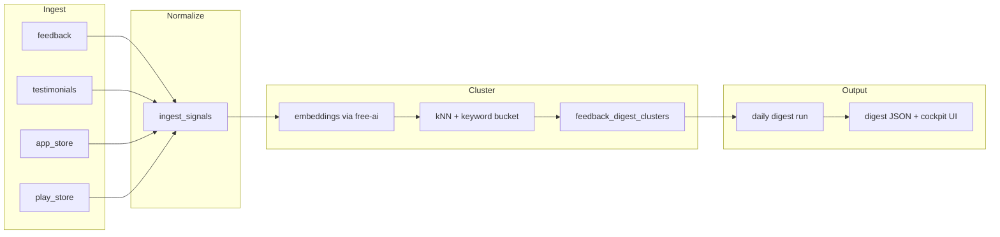

# AI Feedback Digest — Product Module Plan

**Date:** 2026-06-04  
**Status:** Shelved 2026-06-20 — prototype removed with `packages/blocks/ops/` deletion; no production AI/writeback  
**Source:** [saas-ideas](https://github.com/sarthakagrawal927/saas-ideas) at `aba1a83`, triaged in [`docs/ideas/saas-ideas-consolidation-2026-06-03.md`](../ideas/saas-ideas-consolidation-2026-06-03.md)  
**Symphony task:** `764795a4-23c9-4d61-be31-83c2ddec800d`

## Prototype Command

This plan now has a deterministic local prototype in
`packages/blocks/ops/src/feedback-digest.ts`.

Run it with:

```bash
pnpm --dir packages/blocks/ops test -- --run src/__tests__/feedback-digest.test.ts
```

The prototype clusters fixture feedback/testimonial/app-review signals, preserves
source evidence, and emits dry-run task payloads only for actionable clusters.

## Summary

Add a **Feedback Digest** product module to SaaS Maker that clusters heterogeneous user signals (in-app feedback, store reviews, testimonials, and internal changelog/tasks context) into an evidence-backed daily digest. Clustering and summarization are **derived views**; originals stay immutable and linkable. AI runs through existing **project AI Gateway** config, preferring **free-ai** as the default upstream, with explicit token budgets and batching. This pass is design-only: no new production AI endpoints, no broad rate-limit changes.

## Product Thesis

Fleet projects already emit signals into SaaS Maker:

| Source | Today | Role in digest |
|--------|-------|----------------|
| Widget / API feedback | `feedback` table, `/v1/feedback` | Primary complaint/feature signal |
| Testimonials | `testimonials` table, `/v1/testimonials` | Positive social proof + rating |
| Cockpit tasks | `/v1/tasks` (owner-scoped) | “What we already committed to fix” |
| Changelog | `/v1/changelog`, `from-task` | Shipped fixes vs. recurring pain |
| App Store / Play Store reviews | **Not stored yet** | External voice; needs ingest connector |

The digest answers: **“What hurt users yesterday, what praised us, what should become a task, and what evidence supports each claim?”** — without replacing the inbox, task board, or High Signal (competitive/market intelligence stays in `high-signal`).

## Non-Goals (This Module)

- No competitor listening, subreddit scraping, or SEO content pipelines (→ `high-signal`).
- No automatic task creation without human review in v1 (suggestions are drafts).
- No new global or `/v1/*` rate limits without endpoint-specific evidence and a follow-up task.
- No scheduled production AI cron until ingest + cost telemetry exist.
- No paid-model defaults; free/cheap models via free-ai unless a project opts into its own gateway config.

## Evidence Model — Cluster Without Losing Originals

### Principle

**Never mutate source rows for clustering.** All grouping writes go to digest-specific tables. Every cluster summary and AI-generated label must cite `source_type` + `source_id` (+ optional excerpt hash).

### Normalized ingest shape

All sources map to a common **signal** record before clustering:

```ts
type SignalSource =
  | 'feedback'
  | 'testimonial'
  | 'app_store_review'
  | 'play_store_review'
  | 'changelog_entry'
  | 'task'; // context only — not clustered as “complaint” by default

interface IngestSignal {
  id: string;              // digest-local uuid
  project_id: string;
  source_type: SignalSource;
  source_id: string;       // FK to origin table row
  occurred_at: string;     // ISO — store review date or feedback created_at
  channel: 'in_app' | 'app_store' | 'play_store' | 'public_page' | 'internal';
  polarity_hint: 'negative' | 'neutral' | 'positive' | 'unknown';
  title: string | null;
  body: string;            // verbatim text (max length enforced at ingest)
  rating: number | null;   // 1–5 when present
  locale: string | null;
  version: string | null;  // app version from store review when available
  metadata: Record<string, unknown>; // store country, device, feedback type, etc.
  content_hash: string;    // sha256(normalized body) for dedupe
}
```

### Clustering pipeline (offline / job, not inline on write path)



**Stage 1 — Dedupe & window**

- Pull signals for `project_id` where `occurred_at` in digest window (default: previous UTC day; cockpit may pass IST date like fleet changelog).
- Drop exact `content_hash` duplicates; keep earliest `source_id` as canonical, link duplicates in `signal_duplicates` (optional v1: skip table, log count only).

**Stage 2 — Cheap pre-buckets (no LLM)**

- Rule buckets: `rating <= 2`, feedback `type=bug`, feedback status in `new|investigating`, testimonial `rating >= 4`, store review star mapping.
- Keyword stems from project `readme` / known product nouns (cached per project, not LLM-generated in v1).

**Stage 3 — Embedding cluster (batched)**

- Batch embed signal bodies (truncate to 2k chars) via `/v1/ai/embeddings` → project gateway → **prefer `free-ai` base URL** when project has no custom config.
- kNN cluster within project + window; merge clusters with centroid cosine similarity ≥ 0.82 (tunable constant, not env flag).
- Cap clusters at 25 per digest; overflow goes to `misc` bucket with full evidence list.

**Stage 4 — LLM label & summarize (batched, bounded)**

- One completion per cluster (not per signal): prompt includes up to 8 representative excerpts with `source_type/source_id` citations.
- Model: project `ai_model` or fallback `gemini-2.0-flash` / equivalent free-tier route via free-ai.
- Output schema (JSON): `category_label`, `summary`, `severity` (1–5), `suggested_task_title`, `suggested_task_type`, `evidence_ids[]`.

**Stage 5 — Cross-link internal context (read-only)**

- For each cluster, attach **related tasks** (open, same `project_slug`, title/description fuzzy match) and **recent changelog** entries (last 14 days) — no LLM; SQL + light string overlap.
- Mark cluster `likely_addressed` when a merged task or changelog entry matches above threshold.

### Evidence preservation guarantees

| Guarantee | Mechanism |
|-----------|-----------|
| Original text unchanged | Signals copy `body` at ingest time; source tables untouched |
| Traceable claims | Digest sections store `evidence: { source_type, source_id, excerpt }[]` |
| Reproducible runs | `digest_runs` stores window, model, token totals, cluster version |
| Human audit | Cockpit “View originals” deep-links to feedback detail, testimonial row, or external review URL |
| AI hallucination guard | Category labels must cite ≥1 evidence id; validator drops clusters with empty `evidence_ids` |

## Planned Data Model (D1)

New tables (names tentative):

```sql
-- Immutable per-source snapshot for a time window
ingest_signals (...);

-- One row per clustering pass
feedback_digest_runs (
  id, project_id, window_start, window_end, status,
  model, input_tokens, output_tokens, cluster_count,
  created_at
);

-- Cluster within a run
feedback_digest_clusters (
  id, run_id, label, summary, severity,
  polarity, signal_count, positive_ratio,
  suggested_task_title, suggested_task_type,
  likely_addressed, metadata_json
);

-- M:N cluster ↔ signal
feedback_digest_cluster_signals (
  cluster_id, signal_id, is_representative
);

-- Materialized digest for API/UI
feedback_digest_daily (
  id, project_id, day, run_id,
  headline, body_markdown, stats_json,
  published, created_at
);

-- Store review ingest (connector output)
store_review_connections (
  id, project_id, platform, app_id, last_sync_at, credentials_ref
);

store_reviews (
  id, connection_id, external_review_id,
  rating, title, body, version, locale, reviewed_at, raw_json
);
```

`tasks` and `changelog` are **not** copied into `ingest_signals` by default; they are join targets during Stage 5 unless explicitly ingested for “noise from internal notes” in a later phase.

## Output Specification

### Daily digest object (`GET /v1/digest/daily` — planned)

```json
{
  "project_id": "...",
  "day": "2026-06-03",
  "window": { "start": "...", "end": "..." },
  "headline": "3 recurring crash themes; positive ratio 0.62",
  "stats": {
    "signal_count": 47,
    "positive_ratio": 0.62,
    "negative_count": 12,
    "neutral_count": 8,
    "by_channel": { "in_app": 20, "app_store": 15, "play_store": 12 }
  },
  "top_complaint_categories": [
    {
      "rank": 1,
      "label": "Login loop after OAuth",
      "severity": 4,
      "signal_count": 8,
      "summary": "...",
      "evidence": [
        { "source_type": "feedback", "source_id": "...", "excerpt": "..." },
        { "source_type": "app_store_review", "source_id": "...", "excerpt": "..." }
      ],
      "likely_addressed": false,
      "related_tasks": [{ "id": "...", "title": "...", "status": "in_progress" }],
      "related_changelog": []
    }
  ],
  "positives": {
    "testimonial_highlights": [...],
    "five_star_themes": [...]
  },
  "suggested_tasks": [
    {
      "title": "Fix OAuth redirect on mobile Safari",
      "task_type": "bug",
      "priority": "high",
      "rationale": "...",
      "evidence_cluster_id": "...",
      "draft_only": true
    }
  ],
  "raw_index_url": "/projects/:slug/digest/2026-06-03/evidence"
}
```

### Cockpit surfaces (phased)

1. **Digest card** on project home: headline, positive ratio, top 3 categories.
2. **Digest detail**: expandable evidence, links to sources, “Create task from suggestion” (pre-filled POST `/v1/tasks` body).
3. **Settings**: digest on/off, window timezone, store connectors, model override (inherits AI Gateway).

### CLI / API ergonomics

```bash
# Planned — session auth, owner only
fnd api GET /v1/digest/daily --query project_id=... --query day=2026-06-03
fnd api POST /v1/digest/runs --body '{"project_id":"...","day":"2026-06-03"}'  # manual regen
```

## Token & Cost Guardrails

### Defaults

| Guardrail | Value | Notes |
|-----------|-------|-------|
| Max signals per run | 200 | Oldest-first drop with metric `signals_truncated` |
| Max embedding batch | 64 texts | Sequential batches; stop run on 3 consecutive failures |
| Max clusters sent to LLM | 25 | Pre-bucket overflow → `misc` |
| Max input tokens per cluster summary | 6,000 | Hard truncate excerpts |
| Max output tokens per cluster | 800 | JSON-only response |
| Daily runs per project | 1 scheduled + 2 manual | Enforced in `digest_runs`, not global rate limiter |
| Monthly embedding budget | 500k tokens / project | Soft cap → skip embedding stage, keyword-only mode |

### free-ai routing strategy

1. **Project without AI Gateway config:** use fleet `FREE_AI_GATEWAY_URL` (Worker secret) for embeddings + chat; log via existing `ai_requests` with `endpoint` tagged `digest/*`.
2. **Project with custom gateway:** respect `ai_base_url` / `ai_model`; still record usage in `ai_requests`.
3. **Batching:** embed all signals in one job loop; cluster summaries in batches of 5 parallel max (Worker `waitUntil`, not user-facing request).
4. **Cache:** store embedding vector on `ingest_signals.embedding` (blob) keyed by `content_hash` to avoid re-embedding unchanged reviews.
5. **Degraded mode:** if budget exceeded or free-ai unavailable → produce digest with counts + keyword buckets only (no LLM labels).

### Observability

- Extend `ai_requests` metadata or add `digest_runs` token columns for cockpit cost display.
- Alert threshold: single run > 50k tokens → flag run `high_cost` for owner review.
- No new rate-limit middleware; reuse existing `/v1/ai` skip path only where already present.

## Store Review Ingest (Connector — Phase 2)

Not required for plan acceptance; documented for completeness.

| Platform | v1 approach | Evidence |
|----------|-------------|----------|
| App Store | App Store Connect API or RSS + manual CSV upload fallback | `store_reviews.raw_json` retains API payload |
| Play Store | Play Developer API; service account per project | Same |

Connector writes `store_reviews` → normalize job → `ingest_signals`. Sync daily via Cloudflare Cron Trigger **only after** a dedicated follow-up task approves credentials storage pattern (`foundry_secrets` per connection).

## Relationship to Existing Modules

| Module | Interaction |
|--------|-------------|
| Feedback | Primary signal source; inbox UX unchanged |
| Testimonials | Positive polarity; approved-only in public stats |
| Tasks | Suggested tasks are drafts; optional link `suggested_from_digest_run_id` column (future) |
| Changelog / `from-task` | Suppress suggestions when `likely_addressed` |
| AI Gateway `/v1/ai/*` | Sole LLM path; no parallel OpenAI client in digest code |
| Marketing Queue | Optional later: “turn positive cluster into reel idea” — out of v1 |
| Vector memory plan | Optional upgrade for retrieval; not blocking v1 keyword+embedding cluster |
| Dynamic Workers Symphony | Digest **generation** is a candidate cloud job after API exists; not v1 |

## Implementation Phases

### Phase 0 — Plan only (this task)

- [x] Module plan with clustering, outputs, guardrails
- [ ] Symphony task marked done

### Phase 1 — Read path + manual run (MVP)

- Migrations: `ingest_signals`, `feedback_digest_runs`, clusters, `feedback_digest_daily`
- `POST /v1/digest/runs` (session): pull feedback + testimonials for window, no store connector
- `GET /v1/digest/daily`
- Cockpit digest page (read-only)
- Unit tests: normalization, dedupe, evidence validator, degraded mode

### Phase 2 — Store reviews + schedule

- `store_review_connections` + ingest
- Cron: daily per project with `digest_enabled`
- CSV upload fallback for stores without API keys

### Phase 3 — Task suggestions + Symphony hook

- `POST /v1/digest/suggestions/:id/accept` → creates task with evidence in description
- Optional: auto-draft changelog when cluster `likely_addressed` flips after deploy

## Acceptance Criteria Mapping

| Criterion | Section |
|-----------|---------|
| Cluster feedback, store reviews, testimonials, changelog/tasks without losing evidence | Evidence Model, Planned Data Model |
| Output: daily digest, categories, positive ratio, raw links, suggested tasks | Output Specification |
| Token/cost guardrails + free-ai batching | Token & Cost Guardrails |
| No broad rate limiting or production AI without follow-up | Non-Goals; Phase gating |

## Follow-Up Tasks (Create in Cockpit When Implementing)

1. **Phase 1 API + schema** — migrations, manual digest run, tests  
2. **Cockpit digest UI** — project digest page + evidence links  
3. **Store review connector** — credentials, sync job, CSV fallback  
4. **Scheduled digest cron** — explicit approval for production AI schedule  
5. **OpenAPI + CLI docs** — when routes ship (per AGENTS.md workflow)

## Remaining Risk

- **Store APIs** need credential UX and ToS review; CSV fallback may be the practical v1 for solo founders.  
- **Embedding quality** on short angry reviews is noisy; keyword pre-buckets must stay in degraded path.  
- **Task suggestion quality** without human review could create duplicate tasks; `likely_addressed` heuristics will false-positive.  
- **IST vs UTC day boundaries** already bite fleet changelog; digest must reuse the same explicit-date pattern as `GET /v1/changelog/fleet/daily`.  
- **Cost spikes** if a project receives hundreds of store reviews; hard caps and truncated runs must be visible in UI.

## References

- [`docs/plans/2026-02-26-feedback-module-design.md`](2026-02-26-feedback-module-design.md) — core feedback module  
- [`docs/plans/2026-02-27-vector-memory-service-design.md`](2026-02-27-vector-memory-service-design.md) — optional semantic upgrade  
- [`docs/plans/2026-05-02-dynamic-workers-symphony.md`](2026-05-02-dynamic-workers-symphony.md) — tenant automation pattern (“Convert feedback into tasks”)  
- [`workers/api/src/routes/feedback.ts`](../../workers/api/src/routes/feedback.ts), [`testimonials.ts`](../../workers/api/src/routes/testimonials.ts), [`changelog.ts`](../../workers/api/src/routes/changelog.ts), [`ai.ts`](../../workers/api/src/routes/ai.ts)
