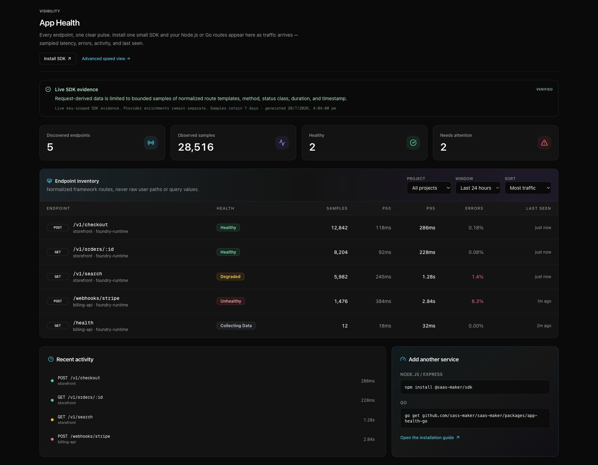
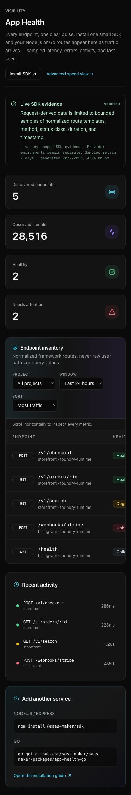

> **Release status:** source-ready, not yet installable. The Node 0.4.0 package,
> Go module tag, production ingest route, Cockpit, and package-docs domain are
> activated together after explicit migration and package-release approval.

App Health is the small endpoint-monitoring layer inside SaaS Maker. Give the
SDK a project API key, install one middleware, and make a request. Normalized
routes and bounded performance samples then appear in the private Cockpit at
`app.sassmaker.com/fleet/app-health`.



The narrow layout keeps the same endpoint inventory available through horizontal
table scrolling:



## Choose your runtime

| Runtime | Install | Guide |
| --- | --- | --- |
| Node.js 20+ / Express 4+ | `npm install @saas-maker/sdk@^0.4.0` | [Node.js and Express](/sdk/app-health-node/) |
| Go 1.22+ / `net/http` | `go get github.com/sass-maker/saas-maker/packages/app-health-go@latest` | [Go and net/http](/sdk/app-health-go/) |

Both SDKs default to the same authenticated ingest endpoint:

```text
https://api.sassmaker.com/v1/performance/spans
```

Node.js and Go 1.23+ need only this setting for automatic route discovery:

```bash
SAASMAKER_API_KEY=pk_your_project_key
```

The key already identifies the SaaS Maker project. Do not add a project slug or
ID to the SDK configuration. Go 1.22 remains supported, but non-root routes also
require `WithRouteResolver` because `Request.Pattern` was added in Go 1.23.

## What appears in Cockpit

As requests arrive, App Health lists each normalized method and route with:

- observed sample count for 1 hour, 24 hours, or 7 days;
- p50 and p95 duration;
- error rate and a text health state;
- the latest observed request;
- project, runtime evidence source, and optional release revision.

Fewer than 20 samples are labeled **Collecting data**. At 20 or more samples,
the default V0 states are:

| State | Condition |
| --- | --- |
| Healthy | error rate below 1% and p95 below 1 second |
| Degraded | error rate at least 1% or p95 at least 1 second |
| Unhealthy | error rate at least 5% or p95 at least 2 seconds |

These states are observation only. They do not alert or block a deploy.

## Privacy boundary

Request-derived data is limited to method, normalized route template, status
class, duration, and timestamp. The delivery envelope also contains generated
schema, surface, environment, idempotency, trace, sampling, runtime/source, and
optional release metadata. The configured SaaS Maker project key is sent only
in the `X-Project-Key` authentication header.

App Health does **not** read or send application-request credentials, request
or response bodies, request headers, cookies, query values, concrete path
parameters, user identity, logs, or stack traces. Framework route templates are
required: unmatched Express paths are dropped; Go 1.23+ uses `Request.Pattern`;
and Go 1.22 needs a resolver for non-root routes.

Counts are observed samples, not total requests. The ingest API caps noisy
routes and the query API marks truncated windows, so App Health does not claim
billing-grade traffic totals.

## Verify the installation

1. Start the instrumented service with `SAASMAKER_API_KEY` set.
2. Request two different routes, including one dynamic route.
3. Open `https://app.sassmaker.com/fleet/app-health`.
4. Select the project and **Last hour**.
5. Confirm the route is templated, for example `/users/:id`, and that no query
   string or concrete identifier appears.

Delivery is asynchronous and fail-open. If evidence does not arrive, inspect
the SDK diagnostics and verify the project key before debugging the application
request itself.

## Agent installation contract

Coding agents should read the runtime-specific guide and the public JSON
manifest at `https://packages.sassmaker.com/app-health/install.json`. The
manifest contains the canonical package identities, required variable,
supported middleware, privacy boundary, and verification steps without
requiring JavaScript execution.
